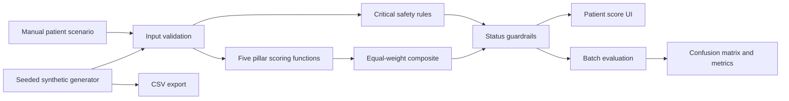

# Solution Architecture

## Layers

### Presentation layer

- React UI
- Scenario inputs
- Score gauge and pillar explanations
- Simulation dashboard

### Decision layer

- Input validation
- Safety-rule engine
- Pillar normalization
- Equal-weight composite
- Status guardrails

### Analytics layer

- Seeded synthetic cohort generation
- Independent scenario labels
- Confusion matrix
- Accuracy and macro F1
- Critical-event sensitivity
- False-reassurance rate

### Verification layer

- Vitest unit tests
- Reproducibility test
- Safety-boundary tests
- GitHub Actions CI
